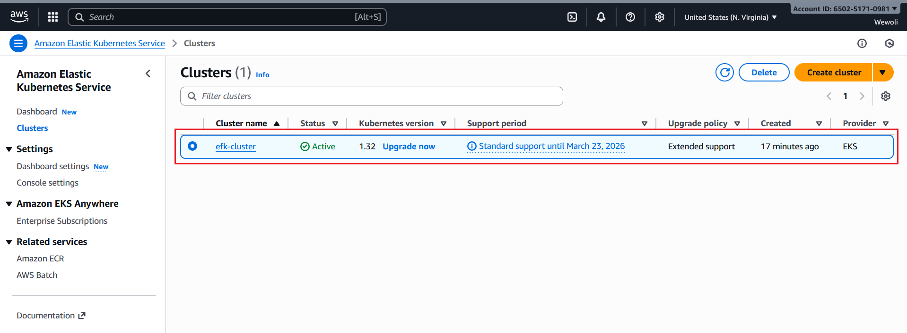

# Building a production-Ready Centralized and Scalable Log Management Solution on Amazon EKS Using the EFK Stack (Elasticsearch, Fluent Bit, and Kibana)


This is a production-ready project that demostrate how you can build Centralized and Scalable log management solution on **Amazon EKS** using the popular **EFK Stack** — **Elasticsearch**, **Fluent Bit**, and **Kibana**. By implementing this project, you will have practical hands-on experience of how to manage logs in a microservice and cloud-native applications. 


## **Table of Contents**

1. [Introduction](#introduction)  
2. [Project Architecture](#project-architecture)  
3. [Prerequisites](#prerequisites)  
4. [Set Up a Kubernetes Cluster](#Set-Up-a-Kubernetes-Cluster])  
      - [Step 1: Create an EKS cluster using eksctl](#Create-an-EKS-cluster-using-eksctl) 
      - [Step 2: install iam-oidc-provider](#install-iam-oidc-provider) 
      - [Step 3: create nodegroup](#create-nodegroup)
      - [Step 4: update-kubeconfig](#update-kubeconfig)
      - [Step 5: Verify cluster connection](#Verify-cluster-connection)
5. [Deploy Sample Applications](#-deploy-sample-applications)
     - [Deploy Nginx app](#Deploy-Nginx-app) 
     - [Deploy Redis app](#Deploy-Redis-app) 
     - [Deploy Django blog app](#Deploy-Django-blog-app) 
6. [Set Up the EFK Stack](#step-3-set-up-the-efk-stack) 
7. [Verification](#verification)  
8. [Cleanup (Optional)](#cleanup-optional)  
9. [Conclusion](#conclusion)

## Introduction
In today's modern cloud-native applications, logging is very critical and should not be an afterthought. help Application logs help in troubleshooting and resolving application failure. Unlike smaller applications with lower traffic, for which you can check logs by simply using the `kubectl logs` command to check the logs of a pod straightforwardly, in a microservices architecture, applications usually have hundreds and sometimes thousands of services: using the usual technique to identify and manage logs is practically impossible and inefficient. Then how do we address this challenge?

Well, we need an efficient log management system to quickly locate the information we need when issues arise; EFK Stack to the rescue. When it comes to Kubernetes log management, the EFK stack stands out as a reliable option. EFK, which stands for Elasticsearch, Fluent Bit, and Kibana, simplifies the process of collecting, analysing, and visualising logs. This stack includes a strong set of tools for managing logs across Kubernetes clusters, allowing you to effectively monitor, troubleshoot, and obtain important insights into your applications.

In this project we will dive deep into how to deploy production-ready log management in AWS EKS using the EFK stack. if you are ready, grab a cup of coffee, and let's gather some logs for efficient management and troubleshooting.


## Project Architecture
The architecture consists of:  
- **Amazon EKS Cluster** hosting containerized applications.  
- **Fluent Bit** as a lightweight log collector and forwarder.  
- **Elasticsearch** for log indexing and storage.  
- **Kibana** for log visualization and querying.  
## Prerequisites

Before you begin, make sure you have the  following prerequisites met:

1. **AWS Account** – You should  have an active AWS account with sufficient permissions to create and manage AWS resources (EKS,EC2 and EBS).  
   👉 [Create an AWS Account](https://aws.amazon.com/resources/create-account/)

2. **AWS CLI** – Installed and configured  with your AWS credentials.  
   👉 [Install AWS CLI](https://docs.aws.amazon.com/cli/latest/userguide/getting-started-install.html)

3. **kubectl** – Installed and configured to manage your Kubernetes cluster.  
   👉 [Install kubectl](https://kubernetes.io/docs/tasks/tools/)

4. **Helm** – Installed for managing Kubernetes packages and deploying Helm charts.  
   👉 [Install Helm](https://helm.sh/docs/intro/install/)

5. **eksctl** – Installed for creating and managing Amazon EKS clusters.  
   👉 [Install eksctl](https://eksctl.io/installation/)

6. **Knowledge Requirement** – A basic understanding of containers, Kubernetes, and cloud-native application concepts.  
   👉 [Learn the Basics of Kubernetes](https://kubernetes.io/docs/concepts/)


## Set Up a Kubernetes Cluster
This section describes how to create and configure a Kubernetes cluster on Amazon EKS using **eksctl**.

### **⚙️ Step 1: Create an EKS Cluster Using eksctl**

Create a new EKS cluster  using the following command:

```bash
eksctl create cluster \
  --name efk-cluster \  
  --region us-east-1 \
  --zones=us-east-1a,us-east-1b \
  --without-nodegroup
```

> ⏱️ *Wait patiently as this process may take several minutes, between 15 to 20 minutes.*

---
### **🧰 Step 2: Install IAM OIDC Provider**

Associate an IAM OpenID Connect (OIDC) provider with your EKS cluster to enable service account authentication:

```bash
eksctl utils associate-iam-oidc-provider \
  --region us-east-1  \
  --cluster efk-cluster \
   --approve
```

expected output

```
2025-10-25 13:25:06 [ℹ]  will create IAM Open ID Connect provider for cluster "efk-cluster" in "us-east-1"
2025-10-25 13:25:07 [✔]  created IAM Open ID Connect provider for cluster "efk-cluster" in "us-east-1"
```

Verify OIDC configuration:

```bash
aws eks describe-cluster \
--name efk-cluster \
--query "cluster.identity.oidc.issuer" \
--output text
```

expected output:

```
https://oidc.eks.us-east-1.amazonaws.com/id/A3048BC2344DF3FCE082A738E4239522

```

### **Step 3: Create Node Group**

Add node a nodegroup to your cluster 

```bash
eksctl create nodegroup   \
--cluster efk-cluster   \
--region us-east-1   \
--name standard-workers   \
--node-type t3.medium   \
--nodes 3   \
--nodes-min 1   \
--nodes-max 4   \
--managed
```


### **Step 4: Update Kubeconfig**

Update your local kubeconfig file to connect `kubectl` to your EKS cluster:

```bash
aws eks update-kubeconfig \
--region us-east-1 \
--name efk-cluster
```
expected output
```
Added new context arn:aws:eks:us-east-1:650251710981:cluster/efk-cluster to C:\Users\simon\.kube\config

```

Confirm your current context:

```bash
kubectl config current-context
```
expected output
```
arn:aws:eks:us-east-1:650251710981:cluster/efk-cluster

```

> 🧠 *This ensures `kubectl` commands are executed against the correct EKS cluster.*


### **Step 5: Verify Cluster Connection**

Verify the health and readiness of your nodes and cluster:

```bash
kubectl get nodes
```

Expected output example:

```
NAME                             STATUS                        ROLES    AGE     VERSION
ip-192-168-18-200.ec2.internal   NotReady,SchedulingDisabled   <none>   21m     v1.32.9-eks-113cf36
ip-192-168-19-74.ec2.internal    Ready                         <none>   3m35s   v1.32.9-eks-113cf36
ip-192-168-22-93.ec2.internal    Ready                         <none>   11m     v1.32.9-eks-113cf36
ip-192-168-26-13.ec2.internal    Ready                         <none>   11m     v1.32.9-eks-113cf36
ip-192-168-38-244.ec2.internal   Ready                         <none>   5m41s   v1.32.9-eks-113cf36
ip-192-168-44-90.ec2.internal    Ready                         <none>   11m     v1.32.9-eks-113cf36

```

> ✅ *Your Kubernetes cluster is now up and running on Amazon EKS.*

---
### **Step 5: Clean up**

```bash
eksctl delete cluster --name observability
```

## Deploy Sample Applications
In this section, we will deploy a set of sample applications to the Kubernetes cluster.
These applications will generate logs that will be collected, processed, and visualized by the EFK stack. The applications are in the apps directory

The following three applications will be deployed:

- Nginx: A lightweight web server used to simulate HTTP traffic and access logs.

- Redis: An in-memory data store that produces operational and event logs.

- A Django blog application : A simple web-based application that generates application-level logs. 

### Deploy Nginx 

---

 **Step 1: Navigate to the nginx directory**
Change  directory to the nginx  folder using this command:
```bash
cd /apps/Nginx/
```
> 💡 *Ensure that the Nginx deployment and service manifest files are available in this directory before proceeding.*

 **Step 2: Deploy the Nginx App**
Use the `kubectl` command to deploy both the **Deployment** and **Service** resources:
```bash
kubectl apply -f nginx-deployment.yaml -n demo-apps
kubectl apply -f nginx-svc.yaml
```
> ✅ *This command creates the Nginx deployment and exposes it as a service within the cluster.*

 **Verification**

Check that the Nginx pods and service are running successfully:

```bash
kubectl get pods -l app=nginx -n demo-apps
kubectl get svc nginx-service  -n demo-apps
```
> 🔍 *If all resources show the “Running” and “Active” states, the Nginx deployment is complete.*

### Deploy Redis app 
---
 **Step 1: Navigate to the Redis Directory**
Change your working directory to the Redis application folder:
```bash
cd /apps/Redis/
```
> 💡 *Ensure that the Redis deployment and service YAML files are available in this directory before proceeding.*

 **Step 2: Deploy Redis to the Cluster**
Run the following commands to apply the Redis manifests:

```bash
kubectl apply -f redis-deployment.yaml -n demo-apps
kubectl apply -f redis-svc.yaml  -n demo-apps
```
> ✅ *This command deploys the Redis application and exposes it within the Kubernetes cluster.*

 **Step 3: Verify Redis Deployment**
Check the status of the Redis resources:

```bash
kubectl get pods -l app=redis -n demo-apps
kubectl get svc redis-service  -n demo-apps
```
> 🔍 *Confirm that the Redis pod is in the “Running” state and the service is active.*

---


### Deploy Django blog app


 **Step 1: Navigate to the Blog Directory**
Change your working directory to the Blog application folder:

```bash
cd /apps/Blog/
```

> 💡 *Make sure the Blog app deployment and service YAML files exist in this path.*

 **Step 2: Deploy the Blog Application**
Use `kubectl` to create the deployment and service for the Blog app:

```bash
kubectl apply -f blog-deployment.yaml -n demo-apps
kubectl apply -f blog-svc.yaml   -n demo-apps
```

> ✅ *This will deploy the Blog application and expose it as a service inside the cluster.*

 **Step 3: Verify Blog Application Deployment**
Confirm the Blog app is running properly:

```bash
kubectl get pods -l app=blog -n demo-apps
kubectl get svc blog-service  -n demo-apps
```

> 🔍 *Ensure that all Blog pods are in the “Running” state and the service is reachable.*

---


## Set Up the EFK Stack

### 🧩 Initial Setup

Elasticsearch is a **stateful application**. To ensure data persistence, you must create an **Amazon EBS (Elastic Block Store) volume** where Elasticsearch can store all logs permanently.

In order for the **EKS cluster** to interact with the EBS volume, some initial configuration is required. Follow the steps below to complete the setup.

---

1. **Create an IAM Role for the Service Account**  
   This role will grant the necessary permissions for the EBS CSI driver to manage EBS volumes on behalf of Kubernetes.

   ```bash
   eksctl create iamserviceaccount \
   --name ebs-csi-controller-sa \
   --namespace kube-system \
   --cluster observability \
   --role-name AmazonEKS_EBS_CSI_DriverRole \
   --role-only \
   --attach-policy-arn arn:aws:iam::aws:policy/service-role/AmazonEBSCSIDriverPolicy \
   --approve
   ```
   
2. **Retrieve the IAM Role ARN**  
   You will need the ARN of the IAM role created in the previous step to associate it with your EKS service account.
   ```bash
   ARN=$(aws iam get-role --role-name AmazonEKS_EBS_CSI_DriverRole --query 'Role.Arn' --output text)
   ```

3. **Deploy the EBS CSI Driver**  
   The EBS Container Storage Interface (CSI) driver enables dynamic provisioning and management of EBS volumes for your Kubernetes workloads.

```bash
eksctl create addon --cluster observability \
--name aws-ebs-csi-driver --version latest \
--service-account-role-arn $ARN --force
```
For more details on EBS CSI driver read [Use Kubernetes volume storage with Amazon EBS](https://docs.aws.amazon.com/eks/latest/userguide/ebs-csi.html)

4. **Create a Namespace for Logging**  
   Create a  namespace named `logging` where all EFK components will be deployed.  
   ```bash
   kubectl create namespace logging
   ```

### Deploy Elasticserach in K8S cluster

### Deploy Kibana in K8S cluster
### Deploy  Fluentbit in K8S cluster
1. Add  the Fluent Helm charts repository

```bash
helm repo add fluent https://fluent.github.io/helm-charts 
```
2. validate that the repo was added
```bash
helm search repo fluent
```
    Add and update Helm repo:
    Install Elasticsearch:
    Verify
  Deploy Elasticsearch
   Deploy Kiban

## Verification
## Cleanup (Optional)
## Conclusion